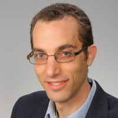
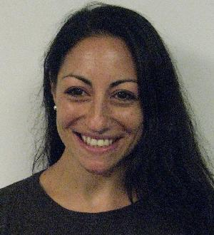
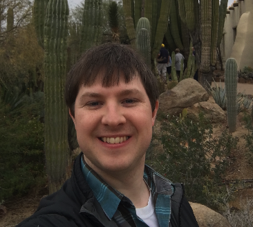
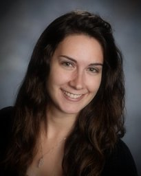
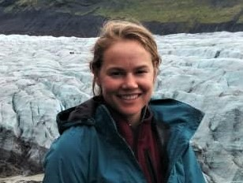
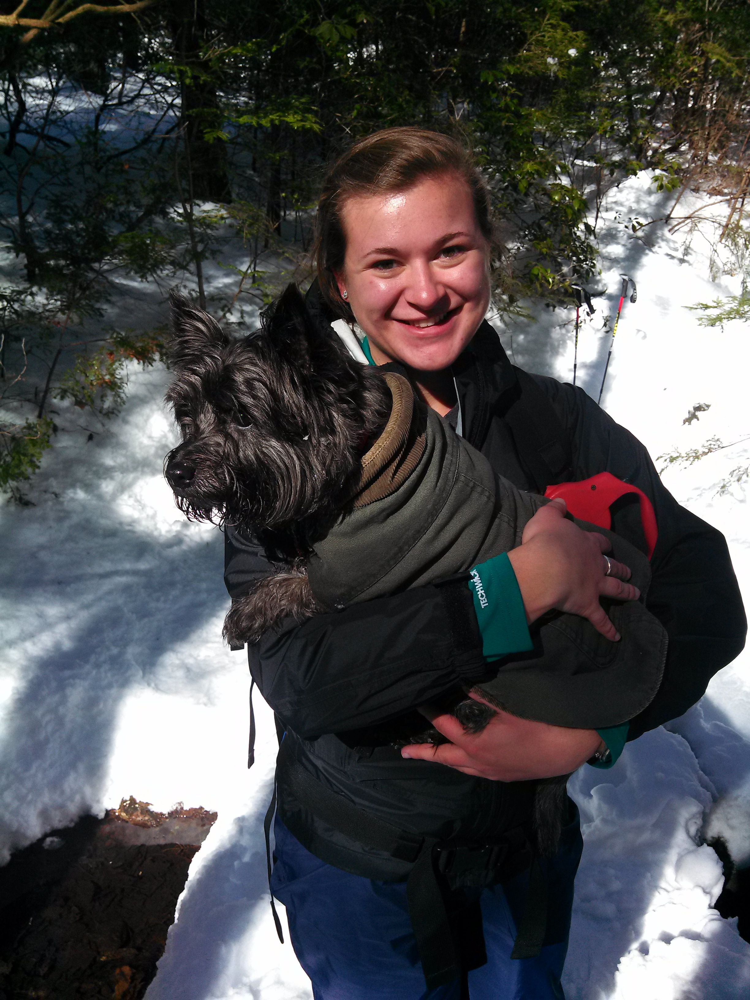
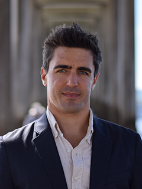
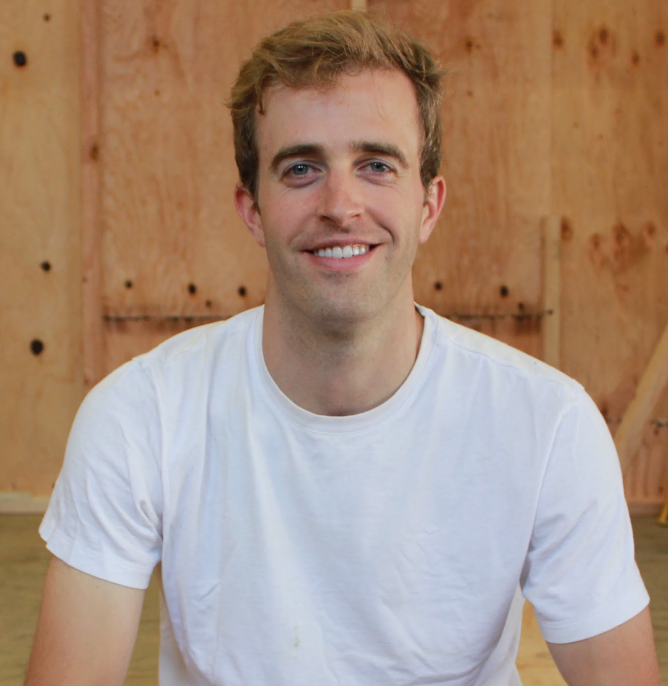

<section id="table-of-contents" class="toc">

*  Auto generated table of contents
{:toc}

</section><!-- /#table-of-contents -->

The Rutgers Earth System Science & Policy Lab takes a transdisciplinary, computationally intensive approach to investigating the evolution of the Earth system, human influences on the Earth system, and policy approaches for managing those human influences. We heavily employ the techniques of Bayesian statistics, geophysical and geochemical modeling, integrated assessment modeling, and quantitative risk analysis. 

Major projects within our Lab at the moment include:

* reconstructing sea-level and ice-sheet changes on timescales ranging from the 20th century, to the late Holocene, to the last 150 thousand years, through statistical and geophysical modeling of geological and observational records;
* probabilistically projecting future changes in sea levels and their implications for changing coastal flood risk, and translating those projected changes into actionable information for coastal adaptation; and
* linking probabilistic simple climate models, complex Earth system models, and econometric analyses of historical weathering and climate impacts to project future risks associated with climate change and improve estimates of the social cost of carbon.

We have close collaborations with colleagues at the [Princeton Science, Technology & Environmental Policy program](https://www.princeton.edu/step/),  the [Berkeley Global Policy Lab](http://www.solomonhsiang.com/lab), the [Earth Observatory of Singapore Sea Level Lab](https://earthobservatory.sg/research-group/sea-level-research-benjamin-horton), and the [Harvard Sea Level Dynamics group](http://isites.harvard.edu/icb/icb.do?keyword=k92805).

We welcome applications from potential graduate students and postdocs with strong computational skills who want to join our group's eclectic mix of statisticians, geophysicists, climate modelers, and policy scholars. Potential graduate students can apply through a variety of Rutgers programs, including [Atmospheric Science](http://envsci.rutgers.edu/academics/atmos_grad/), [Geological Sciences](https://eps.rutgers.edu/academics/graduate/graduate-program),  [Oceanography](https://marine.rutgers.edu/main/academics/graduate), [Statistics](https://www.stat.rutgers.edu/academics/graduate-program), and [Planning and Public Policy](https://bloustein.rutgers.edu/graduate/doctoral-studies/), and are encouraged to consider the [Coastal Climate Risk & Resilience traineeship](http://c2r2.rutgers.edu/). Contact [Bob Kopp](../contact/) for more information.

## People

#### [Bob Kopp, Group Director](/)
{:.no_toc}

<a href="/">

</a>

 I am a climate scientist, Earth historian, geobiologist, and energy policy wonk. My research focuses on understanding uncertainty in past and future climate change, with major emphases on sea-level
change and on the interactions between physical climate change and the economy.

### Research Faculty

#### [Greg Garner](https://sites.google.com/site/gggarner121/)
{:.no_toc}

<a href="https://sites.google.com/site/gggarner121/">

</a>
I am a meteorologist and climate scientist working on a comprehensive computational framework for projecting sea-level rise in a changing climate.  Broadly, I’m interested in how people use tools and information to inform decisions.  This has afforded me the opportunity to study a diverse range of topics including weather, climate change, atmospheric chemistry, air quality, robust decision making, sea-level rise, heatwaves, and more alongside experts in social sciences, statistics, economics, philosophy, mathematics, and engineering.  I use state-of-the-art optimization tools, statistical methods, integrated assessment models, and data analysis to investigate complex problems across multiple disciplines.  I emphasize the importance of science communication throughout my research by publishing with open-access (when available), performing science-outreach activities, and sharing the products of my work through web-based tools and code repositories.

### Postdocs

#### [Erica Ashe](https://scholar.google.com/citations?user=UZ1-b8IAAAAJ&hl=en&oi=sra)
{:.no_toc}

<a href="https://scholar.google.com/citations?user=UZ1-b8IAAAAJ&hl=en&oi=sra">

</a>
Statistics is the mathematical body of science pertaining to collection, organization, analysis, interpretation and presentation of data.  The complex nature of the spatial and temporal data used for
climate process reconstruction produces unique statistical challenges, which highlight the importance of interdisciplinary research.  Without an understanding of the scientific processes underlying
observable data, as well as the theoretical foundations of the statistical tools used in analysis, the data may be misinterpreted.  I am interested in applying this theory to the current problems in
prediction and forecasting, as well as modeling, of the relationships between sea level and ice sheet volumes over time and space, as they relate to unobservable parameters of the geoid.  Using
commonly accepted ice sheet histories and earth parameter profiles, including different lithospheric thicknesses, and upper and lower mantle viscosities, I am developing a stochastic emulator of the
sea-level equation.

#### [Daniel Gilford](http://danielgilford.com)
{:.no_toc}

<a href="http://danielgilford.com">

</a>
I am a climate scientist interested in the answering the question "How do distant climate
phenomena evolve and affect me and my community?" My primary research focuses the deep uncertainties in polar ice-sheet contributions to global and local sea level rise. I use a blend of statistical and machine learning techniques to study ice-sheet model emulation, the emergence of Antarctic contributions to sea level rise, and paleoclimate/observational constraints on ice-sheet model projections. I studied Atmospheric Science with Prof. Susan Solomon at the Massachusetts Institute of Technology, and received my doctorate degree in 2018. My graduate research fused middle atmospheric chemistry, radiation, and tropical cyclone theory to explore tropopause region influences on hurricane intensities. I’m motivated to work on societally relevant problems and science communication, and I aspire to connect science and communities.

#### [Jennifer Walker](https://scholar.google.com/citations?user=0Co0dxEAAAAJ&hl=en&oi=sra)
{:.no_toc}

<a href="httphttps://scholar.google.com/citations?user=0Co0dxEAAAAJ&hl=en&oi=sra">

</a>

  I am broadly interested in sea level research and climate and how sea level rise into the future will affect coastal communities. My research examines past sea-level change to bridge the gap between short-term instrumental records and long-term geological reconstructions and to better understand future sea-level rise under changing climate. I focus on reconstructing Holocene sea-level changes along the U.S. Atlantic coast using biological and geological indicators. These proxies are used to quantify rates of sea-level change and examine spatial and temporal variability. The goal of this research is to improve understanding of past sea level to better predict how sea level rise into the future will affect coastal systems and coastal communities.
  

  
#### [Laura Reynolds](https://scholar.google.com/citations?hl=en&user=dsGpWHcAAAAJ)
{:.no_toc}

<a href="https://scholar.google.com/citations?hl=en&user=dsGpWHcAAAAJ">

</a>
I am a sedimentary geologist who studies how coastlines evolve over time. I am interested in how sediments in salt marshes and other coastal environments archive changes in sea level, tectonics, climate, and human influence. My projects have included reconstructions of relative sea level and the identification of flood deposits and evidence for coseismic subsidence in the coastal stratigraphic record. In my current research, I am working with an interdisciplinary team to build more realistic sediment dynamics into models of future tidal marsh response to sea level rise, with the ultimate goal of integrating models of physical processes in tidal marshes with ecological models of species' population change.

### Graduate students

#### [Kristen Joyse (Earth and Planetary Sciences)](http://geology.rutgers.edu/people-directory/24-graduate-students/707-kristen-joyse)
{: .no_toc}

<a href="http://geology.rutgers.edu/people-directory/24-graduate-students/707-kristen-joyse">

</a>
I am a geoscientist interested in using evidence of past climate change to improve understanding of physical Earth systems and projections of future climate. My interests lie particularly within aspects of climate that have large social implications, including sea level rise, major storm frequency, and resource availability. I am currently a member of Rutgers University’s first cohort of trainees in the Coastal Climate Risk and Resilience initiative, which focuses on the transdisciplinary research and collaboration I am interested in. My current research is focused on relative sea level rise in the Western Mediterranean Basin and its implications for past civilizations. Additionally, I am working on a paleostorm reconstruction for the New Jersey coast from overwash deposits in backbarrier environments.

#### [D.J. Rasmussen (Woodrow Wilson School)](http://www.djrasmussen.co ) 
{: .no_toc}

<a href="http://www.djrasmussen.co">

</a>
I study both the physical and social science aspects of sea-level rise and coastal floods. My career goal is to produce new research that equips coastal stakeholders with information that can aid decisions on coastal flood protection strategies. My hope is that these efforts will lead to future planning and policies that save money and protect human lives. Recently, I’ve been developing a framework for designing coastal flood protection under uncertain sea-level rise. I also examine the politics surrounding efforts to conceive, design, and implement coastal flood protection mega-projects, such as storm surge barriers. I expect to complete my PhD in Public Policy & International Affairs in 2020, and I also have a BS in Atmospheric & Oceanic Science and an MS in Civil & Environmental Engineering.

### External Affiliates

#### [Ian Bolliger (UC-Berkeley)](https://erg.berkeley.edu/people/bolliger-ian/)
{: .no_toc}

<a href="https://erg.berkeley.edu/people/bolliger-ian/">

</a>
I am a Berkeley Graduate Fellow in the Energy and Resources Group (ERG) and the Global Policy Laboratory (GPL) at UC Berkeley, advised by Solomon Hsiang and Daniel Kammen. I am a member of the Climate Impact Lab, in which my research focuses predicting regional, socioeconomic impacts of climate change on coastal communities. I use both empirical and dynamical modeling approaches to address this task, often leveraging the growing database of global satellite imagery. Currently, I am developing a spatially-resolved, probabilistic quantification of the economic risk to coastal communities due to changes in hurricane frequency and intensity that are driven by climate change. I earned my BA in Applied Mathematics from Harvard University in 2011 and MS degrees in Energy and Resources (2016) and Civil and Environmental Engineering (2017) from UC Berkeley. Prior to graduate school I modeled global disease burden at the Institute for Health Metrics and Evaluation in my hometown of Seattle, WA.

#### [Roger Creel (Columbia)](https://www.linkedin.com/in/roger-creel-18629145/)
{: .no_toc}

Roger is a graduate student at Columbia University working with Dr. Jacky Austermann. His research uses records of past sea level to understand ice volume changes during glacial cycles. Current projects involve detecting a Holocene readvance of the Antarctic ice sheet in the sea level record and modeling how Antarctic inception ~34 million years ago changed sea levels. Roger graduated from Amherst College in 2013 with degrees in geology and English, and danced professionally with the Louisville Ballet before matriculating at Columbia.

#### [Megan Lickley (MIT)](http://paocweb.mit.edu/people/mlickley)
{: .no_toc}

Megan is a PhD student at MIT working with advisor Susan Solomon.  She researches the processes, uncertainty, and impacts of modern day climate change.  One of her focuses is on the global water cycle, where she characterizes changes in aridity in large ensembles of General Circulation Models and how these changes coincide with human populations.   She has also studied the relationship between sea surface temperatures and changes in rainfall in southern Africa.  She has collaborated with researchers looking at agricultural impacts and water infrastructure decisions under a changing climate. Her second focus relates to the measurement and estimation of modern day sea level change.  This work has involved the quantification of bias in altimetry measurements of sea level change, and improved ocean representation in sea level estimation.  She is currently working on multiple data assimilation techniques to improve our understanding on the spatial variability of modern day sea level change. Before starting her PhD she spent a year in the Democratic Republic of Congo teaching math courses at the Catholic University of Bukavu.  She also consulted to the World Bank in Uganda, contributing to a climate change impacts report and strategy plan.  In 2012, she completed her Master’s in the Technology and Policy Program at MIT, focusing on climate impacts on coastal infrastructure and spent the following year as a research associate at MIT’s Joint Program on the Science and Policy of Global Change, studying climate impacts on river systems in the United States.

### Alumni

#### Postdocs
{:.no_toc}

* [Andra Garner](https://sites.google.com/site/andrajreed/home?authuser=0)
* [Carling Hay](http://www.carlinghay.com)
* [Dawei Li](https://scholar.google.com/citations?user=qfAPnEIAAAAJ&hl=en&oi=sra)
* [Eric Morrow](http://www.ericmorrow.ca)
* [Jiacan Yuan](https://www.researchgate.net/profile/Jiacan_Yuan)

#### Graduate students co-advised
{:.no_toc}

* [R.D. Baluyot](https://www.linkedin.com/pub/ronidell-baluyot/72/2b5/359), Rutgers M.S. '13 in Geological Sciences
* [Joe Majkut](https://niskanencenter.org/blog/staff/director-of-climate-science-2/), Princeton  Ph.D. '14 in Atmosphere & Ocean Sciences
* [Shankar Chandramowli](https://www.linkedin.com/pub/shankar-chandramowli/10/4a9/78), Rutgers Ph.D. '15 in Public Policy
* [Maya Buchanan](https://www.linkedin.com/in/maya-buchanan-b544a87/), Princeton Ph.D. '17 in Public Policy

#### Undergraduate students
{:.no_toc}

* [Corie Hlavaty](https://www.linkedin.com/in/corie-hlavaty-7a2a92b2/) (senior thesis student; BS '13 in Geological Sciences)
* [Kinan Tadmori](https://www.linkedin.com/pub/kinan-tadmori/b0/42a/212) (undergraduate research assistant, 2012-2013; BS '15 in Biological Sciences/Environmental Policy)
* [Andrew Wang](https://www.linkedin.com/in/andrewericwang/) (undergraduate research assistant, 2012-2013; BS '15 in Mechanical Engineering)
* [Zeal Shah](https://www.linkedin.com/pub/zeal-shah/a3/902/353) (undergraduate research assistant, 2013-2014; BS '15 in Mechanical Engineering)
* [Emily Zee](https://www.linkedin.com/pub/emily-zee/89/19a/56) (undergraduate research assistant, 2013-2014; BS '16 in Mechanical Engineering)
* [Christina Williamson](http://reu.dimacs.rutgers.edu/~chrisw/) (summer research experience, 2016; Pomona College)
* [Rachel DiSciullo](https://www.linkedin.com/pub/rachel-k-disciullo/8a/931/431) (undergraduate research assistant, 2015-2016; BS '16 in Philosophy and Political Science)

